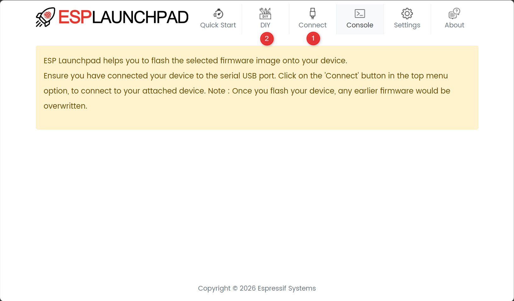
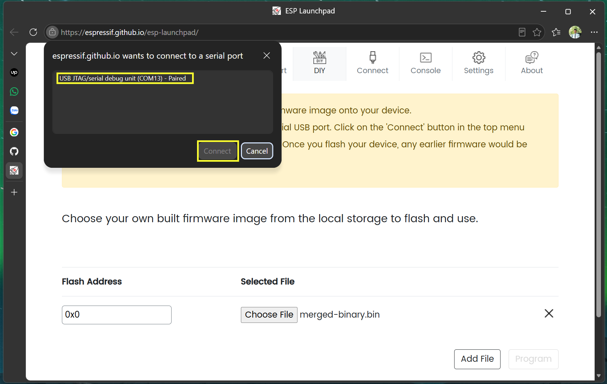
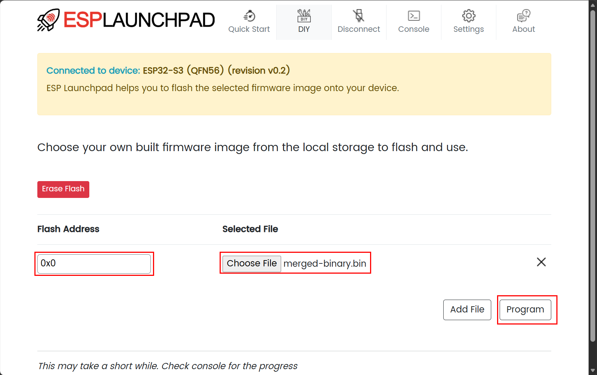

# Programming firmware

Enter the online programming website: [esp-launchpad](https://espressif.github.io/esp-launchpad/)

## 1. Connec to USB port

## 2. Select firmware and programming

Flash address: `0x00`

Select file: `select the firmware file .bin`

Program: `press the button and then wait for finish (100%). Press reset button on board or re-power to run the firmware`.
